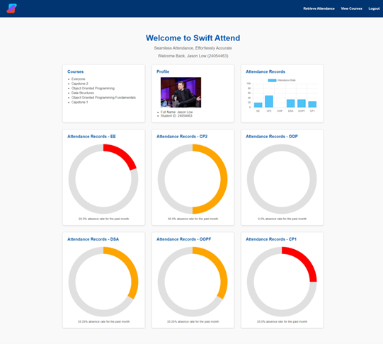
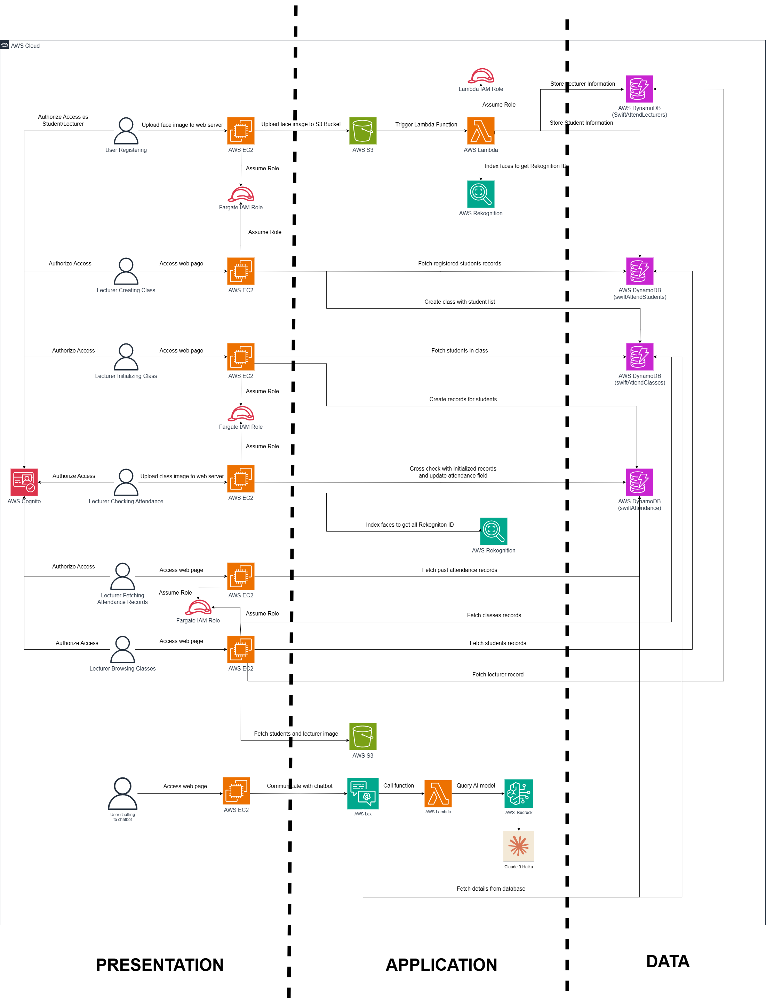
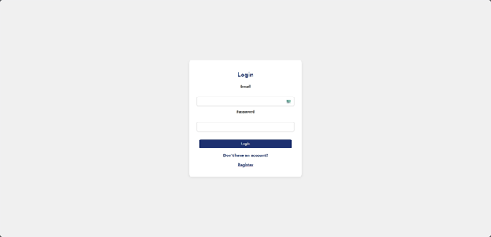
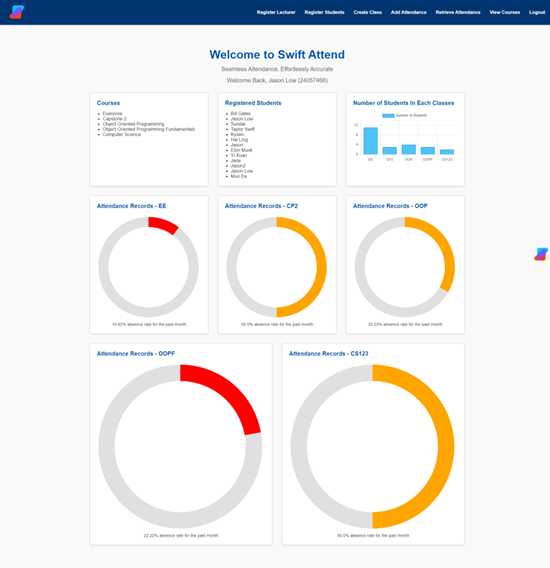
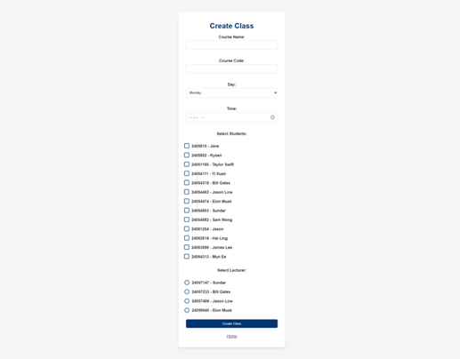
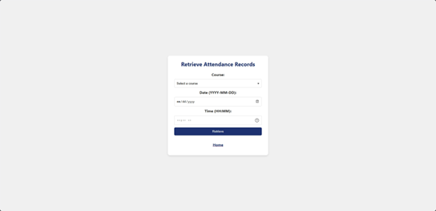
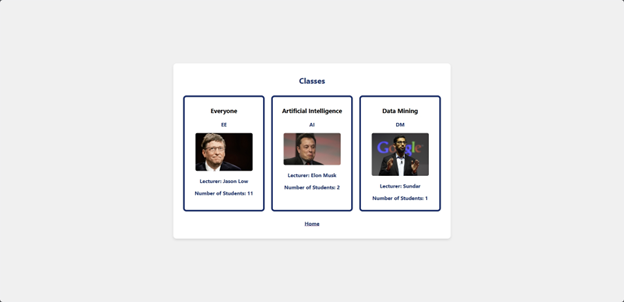
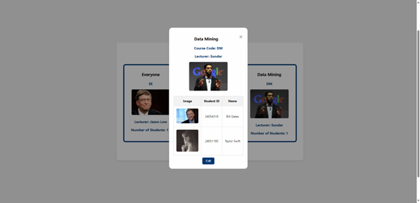

<p align="center">
    
<p>
<br>

<div align="center">
  <a href="https://github.com/jasonlow2307"></a> &ensp;
  <a href="www.linkedin.com/in/jasonlow23"></a> &ensp;
</div>

# SwiftAttend: Efficient Attendance Tracking with AI and Cloud Technology
<figure>
  
</figure>
<br><br>

## Contents
- [🧾 Plan](#Plan)
- [🖥️ Introduction](#Introduction)
- [🚧 Architecture](#Architecture)
- [🖼️ Screenshots](#Screenshots)
- [⚙️ Usage](#Usage)
<br><br>

## <a name="Plan"></a>🧾 Plan

  ### Capstone Project 1 Plan
  - [x] Prototype 
  - [x] Basic UI
  ### Capstone Project 2 Plan
  - [ ] AI Chatbot
  - [ ] Mobile App
  - [ ] Live Attendance Tracking
  - [ ] Improved UI
<br><br>

## <a name="Introduction"></a>📖 Introduction

### Limitations of traditional attendance systems:
- Inefficient and prone to inaccuracies
- Can be easily manipulated 

SwiftAttend addresses these issues by leveraging advanced AI and cloud technologies to streamline and secure the attendance tracking process.

The project aims to deliver a modern and efficient attendance tracking system that:
- **Utilizes Face Recognition:** 
- **Reduces Administrative Time:** 
- **Enhances Learning Experience:** 
- **Employs Cloud Computing:** 
<br><br>

## <a name="Architecture"></a>🚧 Architecture
<figure>
<div align="center">
    
</div>
</figure>

<br>

Every time a lecturer or student wants to perform an action, they must be authorized through AWS Cognito. Additionally, Fargate and Lambda each have their respective IAM roles, which control their access to other AWS services. This architecture is designed to follow a typical three-tier structure, standard for web-native applications hosted on cloud platforms. It includes a frontend, a processing backend, and a database backend. As shown in the figure below, the two dashed lines separate the three tiers in this architecture.
<br>
- **Frontend:** Hosted on AWS Fargate, allowing users to access the web page seamlessly.
- **Processing Backend:** Includes AWS Lambda and Rekognition, which process data received from the frontend and the database backend, performing necessary computations and returning the output to the frontend.
- **Database Backend:** Composed of DynamoDB tables that store records needed by the processing backend.
This separation of concerns ensures a scalable, efficient, and maintainable architecture for Swift Attend.
<br><br>

## <a name="Screenshots"></a>🖼️ Screenshots

### Login/Register
<figure>
  
</figure>
Every user must register for an account and log in before using Swift Attend. Registration will require an email, password, name, role (e.g., student, lecturer, administrator), and an image of themselves.

### Dashboard
#### Lecturer Dashboard
<figure>
  
</figure>
The lecturer’s dashboard, as shown above, will allow them to see the list of courses that they are teaching and the list of registered students. Besides that, they will get a bar chart showing the number of students for each class and multiple bar charts showing the proportion of attendance for each class.
From the navigation bar above, users can access various pages that will allow them to perform different tasks, such as creating a class or adding attendance records. 

#### Student Dashboard
<figure>
  
</figure>
On the other hand, the student’s dashboard shows a list of courses they are enrolled in and their profile. The bar chart shows their past attendance records for each course. Similar to the lecturer’s dashboard, students also get multiple bar charts showing their attendance records for the courses they are enrolled in.  
There will be fewer selections in the student’s navigation bar, as students’ actions will be more restricted relative to a lecturer’s potential actions.

### Class Creation
<figure>
  
</figure>

When a class is being created, a course name, course code, the day of the class, and the class time will be required. For example, a class could have the following information:

<br>

- Course Name: Capstone 1
- Course Code: CP1
- Day: Wednesday
- Time: 5 pm
<br>
Then, students will need to be selected to enroll in the class, and a lecturer will be selected to be in charge of the class.  

### Class Initialization and Attendance Taking
<figure>
  
</figure>
Before a lecturer can add attendance records, they must initialize a class session. A class session will require a date, and a list of created classes to be selected from.
<br><br>
<figure>
  
</figure>
There are currently two ways a lecturer can take attendance: they could either use their device camera to capture an image of the students present in the class or upload an image that has been taken during the class. 
After submitting the image, the attendance records will be displayed to the lecturer, as shown below.
<br><br>
<figure>
  
</figure>

### Attendance Retrieval
<figure>
  
</figure>
When a lecturer wants to retrieve past attendance records, they can search for records by course, by date, and time, or by both simultaneously. These options provides flexibility for the lecturer to filter specific attendance records.

### Course Browsing
<figure>
  
</figure>
Each course will be displayed on its card with basic information when browsing through courses. To retrieve more information on each class, the user can click on the card to get more information and add or remove students, as shown in the image below.
<br><br>
<figure>
  
</figure>

<br><br>

## <a name="Usage"></a>🛠️ Usage
### Requirements
- Python 
- boto3 1.34.91 or later
- botocore 1.34.91 or later
- Flask 3.0.3 or later
- flask_wtf 1.2.1 or later
- Pillow 10.4.0 or later
- WTForms 3.1.2 or later
<br>

1. Repository cloning and dependency installation
```bash
git clone https://github.com/jasonlow2307/swiftAttend.git
cd swiftAttend
pip install -r requirements.txt
```
2. Starting web server
```bash
python3 app.py
```
3. Visit local IP address at port **5000** to view web page
<br><br>

### Contact Me
If you would like to contact me, you can drop me an email at jason.lowjx@gmail.com

Thank you for reading! 💫

