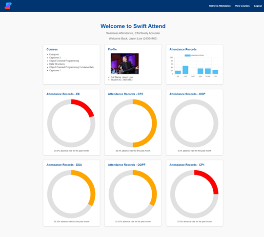

    

 

   &ensp;
   &ensp;

# SwiftAttend: Efficient Attendance Tracking with AI and Cloud Technology
<figure>
  
</figure>
  

## Contents
- [🧾 Plan](#Plan)
- [🖥️ Introduction](#Introduction)
- [🖼️ Screenshots](#Screenshots)
- [⚙️ Usage](#Usage)
  

## 🧾 Plan

- SwiftAttend (Attendance Tracking System)
  ## Capstone Project 1 Plan
  - [x] Prototype 
  - [x] Basic UI
  ## Capstone Project 2 Plan
  - [ ] AI Chatbot
  - [ ] Mobile App
  - [ ] Live Attendance Tracking
  - [ ] Improved UI
  

## 📖 Introduction

Traditional attendance systems are inefficient and prone to inaccuracies. A considerable amount of lecture time is often wasted on taking attendance, detracting from valuable instructional time. Additionally, these systems can be easily manipulated, enabling students to mark their attendance without being present for the entire class. SwiftAttend addresses these issues by leveraging advanced AI and cloud technologies to streamline and secure the attendance tracking process.

The project aims to deliver a modern and efficient attendance tracking system that:
- **Utilizes Face Recognition:** Incorporates advanced face recognition technology to accurately track large groups of students.
- **Reduces Administrative Time:** Reduces the time teachers spend on taking attendance, allowing for more instructional time.
- **Enhances Learning Experience:** Improves the overall teaching and learning experience by streamlining administrative processes.
- **Employs Cloud Computing:** Leverages cloud computing for a scalable, reliable, and accessible solution.
  

## 🎥 Visualization

*Leave this section for me*
  

## 🛠️ Usage

*Leave this section for me*
  

### Contact Me
If you would like to contact me, you can drop me an email at jason.lowjx@gmail.com

